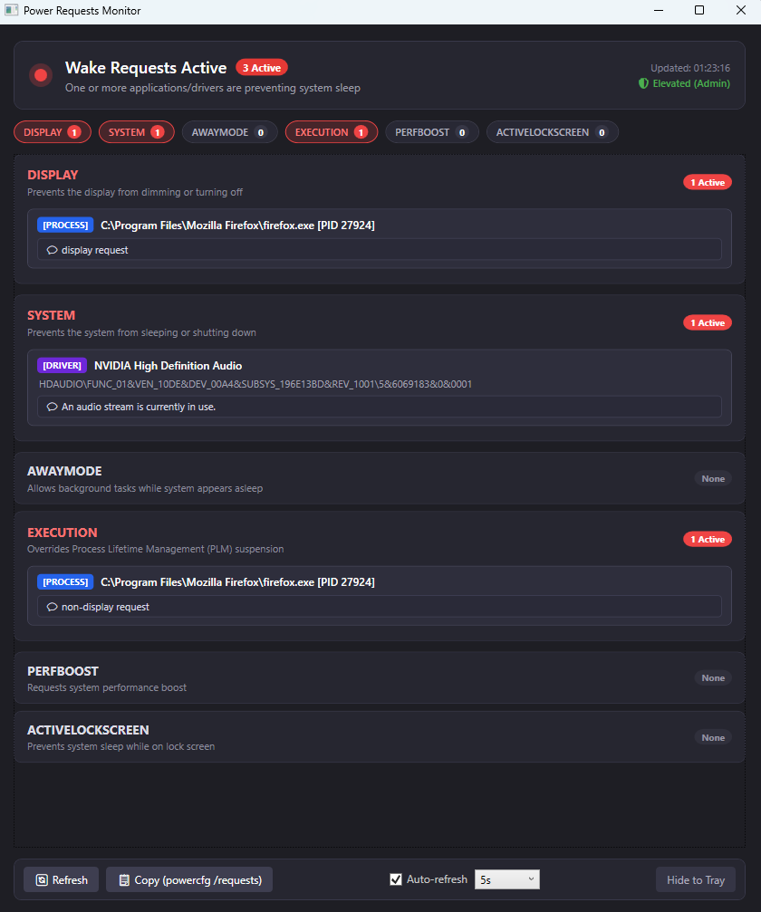

# What is this
A small app that shows wake requests in the style of `powercfg /requests`.
It also has a tray icon that will show if any wake requests are active.

# Who made this?
This app was 100% vibe-coded with the exception of this README.md file.

# License
I claim no copyright since all the code was written by an LLM.

# Compilation
```powershell
dotnet publish PowerApp/PowerApp.csproj -c Release -r win-x64 --self-contained false
```

# Usage
Just run the app, it needs administrator permissions.
